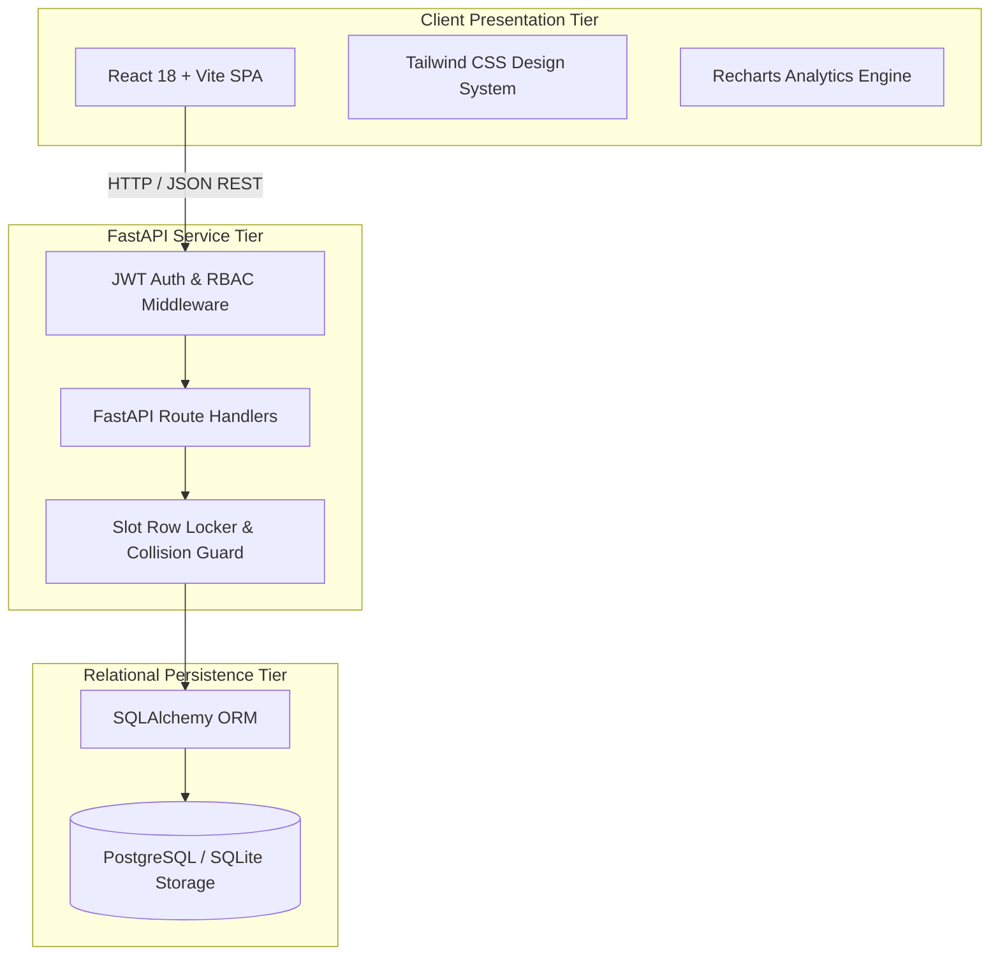
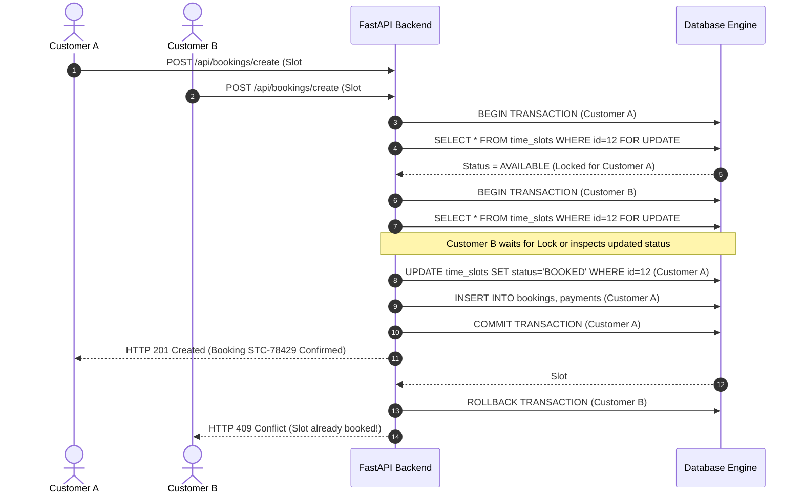
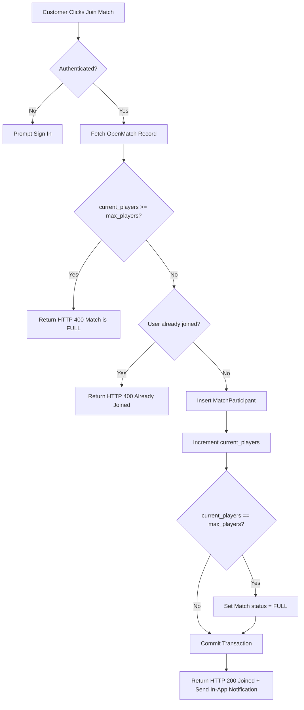

# Architecture & System Design Document
### PLAYSPORT — Sports Facility Management System (MCA Minor Project)

---

## 1. System Overview

PLAYSPORT is designed around a modern decoupled client-server architecture:
- **Client Tier**: Single Page Application (SPA) built with React 18, Vite, and Tailwind CSS.
- **Application Tier**: Asynchronous REST API developed in FastAPI (Python) adhering to OpenAPI 3.0 standards.
- **Data Tier**: Relational schema managed via SQLAlchemy 2.0 ORM with connection pooling, transaction isolation, and foreign key integrity.

---

## 2. Concurrency Control & Double-Booking Safeguard

The primary transactional challenge in sports facility reservation systems is preventing **double booking** (two customers attempting to book the same ground at the same date and time slot simultaneously).

### Safeguard Workflow:
1. **Pessimistic Row Locking**: When a reservation request enters `/api/bookings/create`, the transaction requests locks on the target `time_slots` rows (`SELECT ... FOR UPDATE`).
2. **Atomic Verification**: The transaction verifies that every slot has `status == 'AVAILABLE'`.
3. **Collision Detection**: If any slot in the array is already `BOOKED` or `BLOCKED`, the transaction rolls back immediately and returns `HTTP 409 Conflict`.
4. **Atomic Commit**: All selected slot records have their status changed to `BOOKED` and linked to the new `booking_id` in a single atomic database commit.

---

## 3. Open Match Participant Guard

In the Open Match Arena, individual athletes join matches up to a fixed player capacity (`max_players`).

---

## 4. Extensibility for Future Major Project

Although the current Minor Project intentionally excludes AI/ML per project guidelines, the database schema and service layers are designed to be plug-and-play for the future Major Project:
- Booking history timestamps and weather/city tags allow demand forecasting.
- Review comment embeddings can be indexed for sentiment analysis.
- Match player rosters support skill-based ELO rating algorithms.
