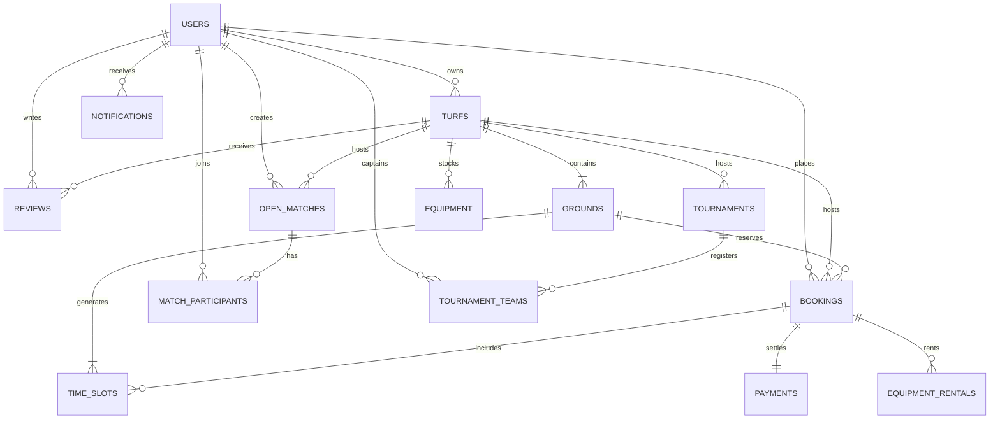

# Database Schema & Entity Relationship Model
### PLAYSPORT — Sports Facility Management System (MCA Minor Project)

---

## 1. Entity Relationship Diagram (ERD)

---

## 2. Table Specifications

### `users`
| Column | Type | Constraints | Description |
|---|---|---|---|
| `id` | INTEGER | PRIMARY KEY, AUTO | Unique user identifier |
| `email` | VARCHAR(255) | UNIQUE, NOT NULL, INDEX | Login email address |
| `username` | VARCHAR(50) | UNIQUE, NOT NULL, INDEX | Alphanumeric handle |
| `full_name` | VARCHAR(100) | NOT NULL | Display name |
| `phone` | VARCHAR(20) | NULLABLE | Contact telephone |
| `hashed_password` | VARCHAR(255) | NOT NULL | Bcrypt hashed secret |
| `role` | ENUM | NOT NULL | `ADMIN`, `OWNER`, `STAFF`, `CUSTOMER` |
| `is_approved` | BOOLEAN | DEFAULT TRUE | Approval flag for Turf Owners |
| `business_name` | VARCHAR(150) | NULLABLE | Facility company name |
| `city` | VARCHAR(100) | NULLABLE | Primary operational city |

### `turfs`
| Column | Type | Constraints | Description |
|---|---|---|---|
| `id` | INTEGER | PRIMARY KEY, AUTO | Facility identifier |
| `owner_id` | INTEGER | FK -> users.id | Turf owner account |
| `name` | VARCHAR(150) | NOT NULL, INDEX | Venue title (e.g. PlayZone Arena) |
| `slug` | VARCHAR(150) | UNIQUE, NOT NULL | URL SEO identifier |
| `address` | VARCHAR(255) | NOT NULL | Physical street location |
| `city` | VARCHAR(100) | NOT NULL, INDEX | City (e.g. Kochi, Bangalore) |
| `rating` | FLOAT | DEFAULT 4.8 | Average verified rating (1.0 - 5.0) |
| `review_count` | INTEGER | DEFAULT 0 | Count of customer reviews |
| `starting_price`| FLOAT | NOT NULL | Base hourly rate |
| `dimension_text`| VARCHAR(50) | DEFAULT '6000 sq ft' | Facility physical dimensions |
| `facilities_json`| TEXT | JSON ARRAY | Amenities list |
| `images_json` | TEXT | JSON ARRAY | Gallery image URLs |

### `grounds`
| Column | Type | Constraints | Description |
|---|---|---|---|
| `id` | INTEGER | PRIMARY KEY, AUTO | Ground/Pitch identifier |
| `turf_id` | INTEGER | FK -> turfs.id | Parent turf |
| `name` | VARCHAR(100) | NOT NULL | Pitch name (e.g. Turf A (5v5)) |
| `sport_type` | VARCHAR(50) | DEFAULT 'Football'| Football, Cricket, Badminton |
| `ground_size` | VARCHAR(50) | DEFAULT '5v5' | Format / pitch specifications |
| `hourly_rate` | FLOAT | NOT NULL | Hourly slot price (₹) |

### `time_slots`
| Column | Type | Constraints | Description |
|---|---|---|---|
| `id` | INTEGER | PRIMARY KEY, AUTO | Unique slot identifier |
| `ground_id` | INTEGER | FK -> grounds.id | Assigned pitch |
| `slot_date` | VARCHAR(20) | NOT NULL, INDEX | Date in `YYYY-MM-DD` |
| `start_time` | VARCHAR(20) | NOT NULL | e.g., `06:00 AM` |
| `end_time` | VARCHAR(20) | NOT NULL | e.g., `07:00 AM` |
| `price` | FLOAT | NOT NULL | Slot price in INR |
| `status` | ENUM | NOT NULL | `AVAILABLE`, `BOOKED`, `BLOCKED` |
| `booking_id` | INTEGER | FK -> bookings.id | Associated confirmed reservation |

*Unique Constraint: `(ground_id, slot_date, start_time)`*

### `bookings`
| Column | Type | Constraints | Description |
|---|---|---|---|
| `id` | INTEGER | PRIMARY KEY, AUTO | Booking ID |
| `booking_reference` | VARCHAR(50) | UNIQUE, INDEX | Reference code (e.g. `STC-78429`) |
| `user_id` | INTEGER | FK -> users.id | Customer who reserved |
| `turf_id` | INTEGER | FK -> turfs.id | Facility reserved |
| `ground_id` | INTEGER | FK -> grounds.id | Pitch reserved |
| `booking_date` | VARCHAR(20) | NOT NULL, INDEX | Reservation date |
| `start_time` | VARCHAR(20) | NOT NULL | Booking start time |
| `end_time` | VARCHAR(20) | NOT NULL | Booking end time |
| `total_amount` | FLOAT | NOT NULL | Total calculation |
| `final_amount` | FLOAT | NOT NULL | Net payment amount |
| `status` | ENUM | NOT NULL | `CONFIRMED`, `PENDING`, `CANCELLED` |

---

## 3. Database Indexes & Query Optimization

- B-Tree index on `turfs.city` and `turfs.rating` for fast geo-discovery.
- Composite index on `time_slots(ground_id, slot_date)` for sub-millisecond calendar rendering.
- Unique index on `bookings.booking_reference` for O(1) digital receipt verification.
